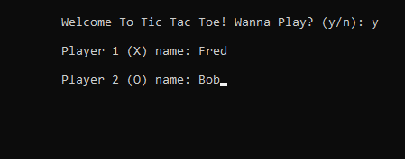
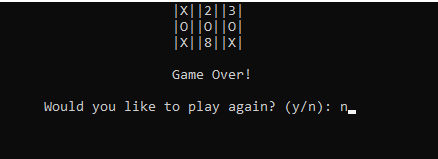

# Console Application 

## Lab 04 Tic Tac Toe

*Author: Joseph Hangarter*

Version: 1.00

----

## Description
* This is a C# console application that allows two players to play tic tac toe.
* Each player will be given a turn, pick between 1 and 9 to place your marker (X or O) on the board.
* A player wins if 3 markers are of the same kind are placed horizontally, vertically, or diagonally.
---

### Getting Started
Clone this repository to your local machine.

```
$ git clone [https://github.com/JCode1986/Lab-04-Tic-Tac-Toe.git]
```

### To run the program from Visual Studio:
Select ```File``` -> ```Open``` -> ```Project/Solution```

Next navigate to the location you cloned the Repository.

Double click on the ```Tic-Tac-Toe``` directory.

Then select and open ```Tic-Tac-Toe.sln```

---

### Visuals

#### Application
* Start of the game

#### Using the Application
* Pick between numbers 1 - 9 for your input


---

